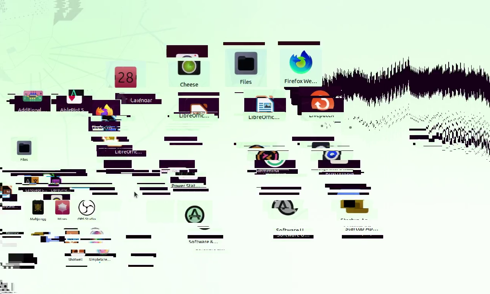

# ü.exe

ü.exe is a malware creates flashy screen effects, and destroy the partitions of your computer (not now).

Supported systems: Windows XP+, *wine*

The destruction part has not been written yet, so feel free to run it on your computer. This line will be deleted when the destruction part is finished.

## License
This project is licensed with AGPL-3.0. If you use the code in this project, then your project must be open source.

source code used: [Monoxide](https://github.com/whypet/Monoxide)